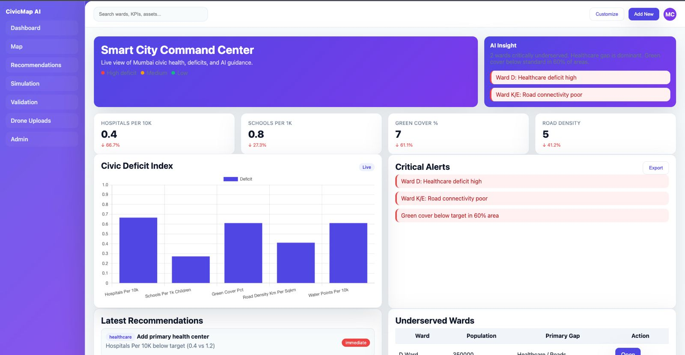
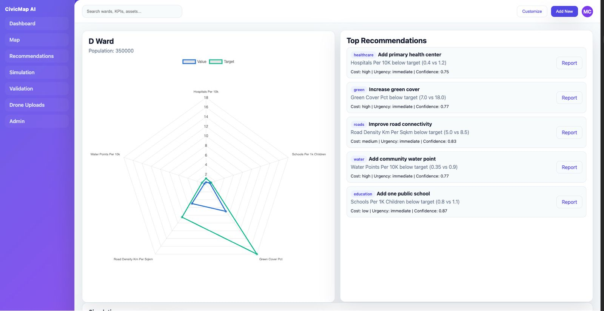
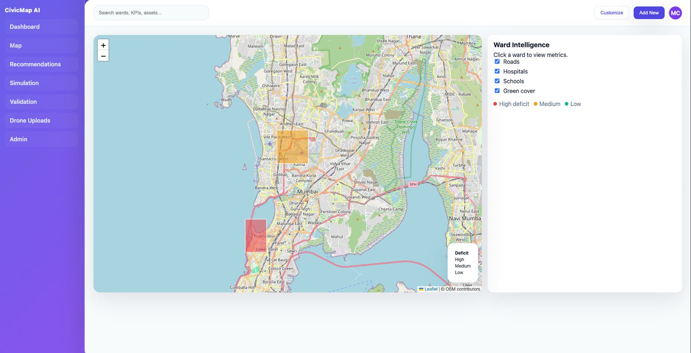

# CivicMap AI — Smart City Command Center

## Project Overview
CivicMap AI is a smart city command-center that fuses satellite (Sentinel‑2), drone imagery, OpenStreetMap, ward boundaries, population estimates, and benchmark datasets into a unified, audit-ready platform. It detects and maps civic infrastructure, computes ward KPIs, quantifies service deficits, generates explainable recommendations, and lets planners simulate interventions—all inside a modern HTML dashboard backed by FastAPI and PostGIS.

## Run (demo)
```bash
python3.11 -m venv .venv311 && source .venv311/bin/activate
pip install -r requirements.txt
export DEMO_MODE=true
uvicorn apps.api.main:app --reload
```
Open http://localhost:8000/dashboard

## Datasets (Mumbai-first)
Place production data under `data/mumbai/`:
- `wards.geojson` (BMC wards)
- `population.csv` (Census + BMC estimates)
- `benchmarks.csv` (NSS/MOSPI targets)
- `osm_extract.pbf`, `osm_assets.geojson` (OSM backbone)
- `sentinel2_manifest.json`, `sentinel2_tiles/` (Sentinel-2 green cover & density)
- `drone_uploads/` (verification imagery)
Bundled fallback: `data/sample/*`

## Report
Detailed report: `docs/CivicMap_AI_Report.docx`

## Architecture (brief)
Frontend: HTML/CSS/JS (Leaflet, Chart.js) • Backend: FastAPI • DB: PostgreSQL + PostGIS • AI: PyTorch scaffolding • GIS: GeoPandas, GDAL, Rasterio • Validation: NSS/MOSPI/OSM discrepancy checks • Visualization: Leaflet + Chart.js

## Key Features
- Explainable, rule+score recommendations with urgency, cost, confidence, impact
- Equity-aware priority boosts
- Simulation with before/after KPIs and CDI delta
- Validation tracker (discrepancies, audit samples)
- Printable, responsive HTML UI (San Francisco font)

## Paths of interest
- API: `apps/api/routers/api.py`
- Pages: `templates/*.html`
- Styles: `static/css/*`
- Scripts: `static/js/*`
- Demo data: `data/sample/`, `data/mumbai/`

## Results (screenshots)




